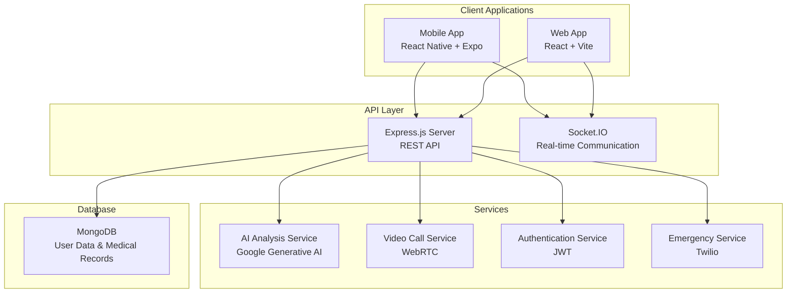

# 🏥 CureConnect - Comprehensive Healthcare Platform

<div align="center">
  
  
  [](LICENSE)
  [](https://reactnative.dev/)
  [](https://reactjs.org/)
  [](https://nodejs.org/)
  [](https://mongodb.com/)
</div>

## 📋 Table of Contents
- [Overview](#overview)
- [Features](#features)
- [Architecture](#architecture)
- [Technology Stack](#technology-stack)
- [Installation & Setup](#installation--setup)
- [Project Structure](#project-structure)
- [API Documentation](#api-documentation)
- [Mobile App Features](#mobile-app-features)
- [Web Application Features](#web-application-features)
- [Contributing](#contributing)
- [License](#license)

## 🌟 Overview

**CureConnect** is a comprehensive healthcare platform that combines mobile and web technologies to provide accessible healthcare services. Developed for AGTechathon 2k25, this platform bridges the gap between patients and healthcare providers through innovative AI-powered analysis, telemedicine services, and emergency response systems.

### Mission
To make quality healthcare accessible to everyone through technology, providing instant medical analysis, expert consultations, and emergency services in a unified platform.

## ✨ Features

### 🔬 AI-Powered Medical Analysis
- **Multi-Modal Analysis**: Support for images, videos, and real-time analysis
- **Specialized Analysis Types**:
  - 🫀 **ECG Analysis**: Electrocardiogram interpretation and heart health assessment
  - 🦴 **X-Ray Analysis**: Bone fracture detection and radiological interpretation
  - 🎗️ **Cancer Detection**: Advanced cancer screening and risk assessment
  - 🧠 **Alzheimer's Analysis**: Cognitive assessment and early detection
  - 🌟 **Skin Analysis**: Dermatological condition identification
  - 👁️ **Retinopathy Detection**: Eye health assessment and diabetic retinopathy screening
  - 🏥 **General Health Analysis**: Comprehensive health screening

### 🩺 Telemedicine Services
- **Video Consultations**: High-quality video calls with healthcare professionals
- **Real-time Chat**: Instant messaging with medical experts
- **Emergency Consultations**: Priority access for urgent medical needs
- **Multi-language Support**: Available in English and Hindi

### 🚨 Emergency Services
- **24/7 Emergency Hotline**: Instant access to emergency services (8047492503)
- **IVR System**: Interactive Voice Response for quick emergency routing
- **Location-based Services**: Automatic routing to nearest medical facilities
- **Emergency Notifications**: Real-time alerts to connected healthcare providers

### 💡 Health & Wellness
- **Daily Health Tips**: Curated health advice and wellness tips
- **Medical History Tracking**: Comprehensive health record management
- **Health Resources**: Educational content and preventive care guides

### 🔐 Security & Privacy
- **JWT Authentication**: Secure user authentication and session management
- **Data Encryption**: End-to-end encryption for sensitive medical data
- **HIPAA Compliance**: Healthcare data protection standards

## 🏗️ Architecture



## 🛠️ Technology Stack

### Mobile Application
- **Framework**: React Native 0.79.3 with Expo ~53.0.11
- **Navigation**: Expo Router ~5.1.0
- **State Management**: Redux with Redux Persist
- **UI Components**: React Native Elements, Expo Vector Icons
- **AI Integration**: Google Generative AI
- **Internationalization**: i18next
- **Media Handling**: Expo Image Picker, Expo AV

### Web Application
- **Frontend**: React 19.0.0 with Vite 6.1.0
- **Styling**: Tailwind CSS 4.0.8, Material-UI 6.4.5
- **State Management**: Redux with Redux Toolkit
- **Routing**: React Router DOM 7.2.0
- **UI Components**: Material-UI, Lucide React Icons
- **Real-time Features**: Socket.IO Client 4.8.1
- **Payment Integration**: Stripe React
- **Video Calls**: ZegoCloud UI Kit

### Backend Services
- **Runtime**: Node.js with Express.js 5.1.0
- **Database**: MongoDB with Mongoose 8.15.2
- **Authentication**: JSON Web Tokens (JWT) 9.0.2
- **Real-time Communication**: Socket.IO 4.8.1
- **Security**: bcryptjs, CORS, Express Rate Limit
- **Communication**: Twilio 5.7.1, Nodemailer 7.0.3
- **Environment Management**: dotenv 16.5.0

<div align="center">
  
  
  
  
  
  
  
</div>

## 🚀 Installation & Setup

### Prerequisites
- Node.js (v18 or higher)
- npm or yarn
- MongoDB instance
- Expo CLI (for mobile development)
- Git

### 1. Clone the Repository
```bash
git clone https://github.com/your-org/CureConnect.git
cd CureConnect
```

### 2. Backend Setup
```bash
cd web/Backend
npm install

# Create environment file
cp .env.example .env
# Configure your environment variables:
# - MONGODB_URI
# - JWT_SECRET
# - TWILIO_ACCOUNT_SID
# - TWILIO_AUTH_TOKEN
# - GOOGLE_AI_API_KEY

# Start the backend server
npm run dev
```

### 3. Web Frontend Setup
```bash
cd web/Frontend
npm install

# Start the development server
npm run dev
```

### 4. Mobile App Setup
```bash
cd app
npm install

# Start Expo development server
npx expo start
```

### 5. Environment Configuration

#### Backend (.env)
```env
MONGODB_URI=mongodb://localhost:27017/cureconnect
JWT_SECRET=your-jwt-secret-key
JWT_EXPIRE=7d
PORT=5001
TWILIO_ACCOUNT_SID=your-twilio-sid
TWILIO_AUTH_TOKEN=your-twilio-token
GOOGLE_AI_API_KEY=your-google-ai-key
```

#### Frontend (.env)
```env
VITE_API_URL=http://localhost:5001/api/v1
VITE_SOCKET_URL=http://localhost:5001
VITE_GOOGLE_AI_API_KEY=your-google-ai-key
```

## 📁 Project Structure

```
CureConnect/
├── 📱 app/                           # React Native Mobile App
│   ├── app/                          # App screens and navigation
│   │   ├── dashboard.tsx             # Main dashboard
│   │   ├── emergency.tsx             # Emergency services
│   │   ├── models.tsx                # AI model selection
│   │   ├── specific-*.tsx            # Specialized analysis screens
│   │   └── healthtips.tsx            # Health tips and wellness
│   ├── assets/                       # Images and media files
│   ├── utils/                        # Utility functions and i18n
│   ├── package.json                  # Dependencies and scripts
│   └── README.md                     # Mobile app documentation
│
├── 🌐 web/                          # Web Application
│   ├── Frontend/                     # React Web Frontend
│   │   ├── src/
│   │   │   ├── pages/               # Main application pages
│   │   │   ├── components/          # Reusable React components
│   │   │   ├── actions/             # Redux actions
│   │   │   ├── reducers/            # Redux reducers
│   │   │   └── App.jsx              # Main app component
│   │   └── package.json             # Frontend dependencies
│   │
│   └── Backend/                      # Node.js Backend API
│       ├── routes/                   # API route definitions
│       ├── models/                   # MongoDB data models
│       ├── controllers/              # Business logic controllers
│       ├── middleware/               # Authentication & validation
│       ├── utils/                    # Helper functions
│       ├── server.js                 # Main server file
│       └── package.json              # Backend dependencies
│
├── 📚 Instructions/                  # Project documentation
│   ├── README.md                     # Setup and rules
│   └── AGTECHATHON.png              # Event documentation
│
├── LICENSE                           # LGPL v2.1 License
├── .gitignore                        # Git ignore rules
└── README.md                         # This file
```

## 📱 Mobile App Features

### Dashboard & Navigation
- **Intuitive Interface**: Clean, healthcare-focused design
- **Multi-language Support**: English and Hindi interface
- **Quick Access**: Emergency services, AI analysis, and telemedicine
- **Carousel Interface**: Featured services with auto-scrolling

### AI Analysis Features
- **Camera Integration**: Direct photo capture for analysis
- **Gallery Upload**: Select existing images for analysis
- **Real-time Processing**: Instant AI-powered medical analysis
- **History Tracking**: Save and review past analyses

### Emergency Services
- **One-touch Emergency**: Quick access to emergency hotline
- **IVR Integration**: Automated emergency response system
- **Location Services**: GPS-based emergency routing

## 🌐 Web Application Features

### Analysis Dashboard
- **Comprehensive Analysis Types**: 7+ specialized medical analysis tools
- **Image & Video Support**: Multi-format medical data processing
- **Real-time Results**: Instant AI-powered analysis and recommendations
- **Export Functionality**: PDF reports and data export

### Telemedicine Platform
- **Video Consultations**: High-quality video calls with doctors
- **Chat Integration**: Real-time messaging during consultations
- **Appointment Scheduling**: Book and manage medical appointments
- **Prescription Management**: Digital prescription handling

### User Management
- **Profile System**: Comprehensive user profiles with medical history
- **Authentication**: Secure login with JWT tokens
- **Medical Records**: Centralized health record management
- **Data Privacy**: HIPAA-compliant data handling

## 🔌 API Documentation

### Authentication Endpoints
```
POST /api/v1/auth/register    # User registration
POST /api/v1/auth/login       # User login
POST /api/v1/auth/logout      # User logout
GET  /api/v1/auth/profile     # Get user profile
```

### Analysis Endpoints
```
POST /api/v1/analysis/upload     # Upload and analyze medical data
GET  /api/v1/analysis/history    # Get analysis history
GET  /api/v1/analysis/:id        # Get specific analysis
```

### Emergency Endpoints
```
POST /api/v1/emergency/alert     # Trigger emergency alert
GET  /api/v1/emergency/services  # Get nearby emergency services
```

### WebSocket Events
```
connection                    # Client connection
join-room                    # Join video call room
emergency-request            # Emergency notification
user-message                 # Chat message
```

## 🎯 Key Features Breakdown

### 🤖 AI Analysis Capabilities
1. **ECG Analysis**: Heart rhythm analysis and arrhythmia detection
2. **X-Ray Analysis**: Bone fracture detection and diagnostic insights
3. **Cancer Screening**: Multi-type cancer detection and risk assessment
4. **Alzheimer's Detection**: Cognitive assessment through various modalities
5. **Skin Analysis**: Dermatological condition identification
6. **Retinopathy Screening**: Diabetic eye disease detection
7. **General Health**: Comprehensive health status assessment

### 🏥 Healthcare Services
- **24/7 Emergency Hotline**: Always available emergency services
- **Telemedicine**: Connect with healthcare professionals remotely
- **Health Tips**: Daily wellness and preventive care advice
- **Medical History**: Comprehensive health record tracking
- **Multi-language Support**: Accessible in multiple languages

### 🔒 Security Features
- **End-to-end Encryption**: Secure data transmission
- **JWT Authentication**: Secure user session management
- **Data Privacy**: HIPAA-compliant data handling
- **Secure Storage**: Encrypted medical record storage

## 🤝 Contributing

We welcome contributions to CureConnect! Please follow these steps:

1. **Fork the Repository**
2. **Create a Feature Branch**: `git checkout -b feature/AmazingFeature`
3. **Commit Changes**: `git commit -m 'Add some AmazingFeature'`
4. **Push to Branch**: `git push origin feature/AmazingFeature`
5. **Open a Pull Request**

### Development Guidelines
- Follow existing code style and conventions
- Write comprehensive tests for new features
- Update documentation for any API changes
- Ensure HIPAA compliance for healthcare-related features

### Code Style
- **JavaScript/TypeScript**: ESLint configuration provided
- **React**: Follow React best practices and hooks patterns
- **Node.js**: Follow Express.js conventions and async/await patterns

## 📄 License

This project is licensed under the GNU Lesser General Public License v2.1 - see the [LICENSE](LICENSE) file for details.

## 🏆 AGTechathon 2k25

This project was developed for AGTechathon 2k25, following all competition guidelines:
- ✅ No external repository cloning
- ✅ No complete tutorial following
- ✅ Original development with incremental commits
- ✅ Theme compliance with healthcare focus
- ✅ Regular code pushes throughout development

## 📞 Support & Contact

For support, feature requests, or general inquiries:
- **Emergency Services**: 8047492503 (24/7 availability)
- **Project Issues**: Create an issue on GitHub
- **Documentation**: Check the `/Instructions` directory

## 🙏 Acknowledgments

- **AGTechathon 2k25** for the opportunity and theme
- **Google AI** for generative AI capabilities
- **Expo & React Native** for mobile development framework
- **React & Vite** for modern web development tools
- **MongoDB & Node.js** for robust backend infrastructure

---

<div align="center">
  <p><strong>CureConnect - Connecting Care, Empowering Health</strong></p>
  <p>Built with ❤️ for AGTechathon 2k25</p>
</div>
